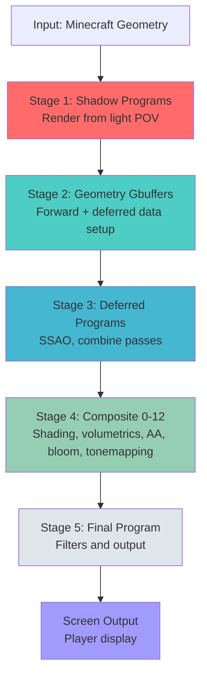
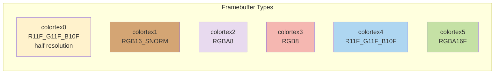

# Pipeline Architecture

**Version**: 1.3.9-beta.4  
**Scope**: Core architectural overview, framebuffer design, rendering flow  
**Related Docs**: [PROGRAMS.md](PROGRAMS.md) | [BUFFERS.md](BUFFERS.md) | [FEATURES.md](FEATURES.md)

---

## Table of Contents

1. [Quick Reference](#quick-reference)
2. [Pipeline Overview](#pipeline-overview)
3. [Framebuffer Architecture](#framebuffer-architecture)
4. [Rendering Pipeline Flow](#rendering-pipeline-flow)
5. [Formatting Standards](#formatting-standards)

---

## Quick Reference

### Essential Numbers

| Metric | Value | Notes |
|--------|-------|-------|
| Color Targets | 6 | `colortex0` is half width and half height |
| Rendering Stages | 5 | Shadow → Gbuffers → Deferred → Composite → Final |
| Composite Programs | 13 | `composite` and `composite1`–`composite12`; some are conditional/disabled |
| GLSL Version | 3.3 Compatibility | 3.3 Core for gbuffers_line only |
| Maximum Shadow Resolution | 8192 | Shader menu slider domain |
| Half-Resolution Target | `colortex0` | Used for volumetrics and bloom processing |

### Quick File Map

| What to Find | Location |
|---|---|
| Pipeline flow diagram | [Pipeline Overview](#pipeline-overview) |
| Framebuffer formats & usage | [BUFFERS.md](BUFFERS.md) |
| All rendering programs | [PROGRAMS.md](PROGRAMS.md) |
| How features work | [FEATURES.md](FEATURES.md) |
| Macro settings | [SETTINGS.md](SETTINGS.md) |

---

## Pipeline Overview

Super Duper Vanilla uses a **hybrid deferred/forward rendering approach** that balances Minecraft's entity/particle system with PBR visual quality.

### Rendering Flow



### Architectural Principles

1. **Performance First**: Resource minimization is top priority over maximum quality
2. **Deferred-Hybrid Model**: G-Buffers store PBR data, then deferred stages compute complex lighting
3. **Ordered Composite Passes**: Passes execute in order with explicit target dependencies; not every pass reads only its predecessor's output
4. **Feature Modularity**: Individual features toggle via preprocessor macros in `settings.glsl`
5. **World-Aware Rendering**: Dimension-specific shader files override base shaders (world-X/ folders)
6. **Data Multipurposing**: Buffers are reused across stages; `colortex0` is configured at half width and height for reduced-resolution work

### Composite Passes

Composite programs run after deferred shading and use explicit buffer dependencies. The detailed pass responsibilities and enable conditions are maintained in [PROGRAMS.md](PROGRAMS.md). The main reduced-resolution path is volumetrics through `colortex0`, followed later by bloom reuse of that target.

---

## Framebuffer Architecture

### 6-Buffer Configuration

Super Duper Vanilla uses six color targets. Their formats, contents, and read/write lanes are documented in [BUFFERS.md](BUFFERS.md).



`colortex0` is allocated at `0.5 × 0.5` in `shaders.properties`, so it contains one quarter as many pixels as a full-resolution target. Total VRAM depends on render resolution, target formats, depth targets, and shadow-map settings; a fixed 88 MB estimate is not retained here.

### Buffer Details

| Buffer | Format | Current use | Resolution / lifecycle |
|--------|--------|-------------|-----------------------|
| **colortex0** | R11F_G11F_B10F | Volumetrics, then bloom intermediates | Half width and half height; reused across passes |
| **colortex1** | RGB16_SNORM | Surface normals | Full view dimensions |
| **colortex2** | RGBA8 | Albedo and SSAO data | Full view dimensions |
| **colortex3** | RGB8 | Material data and post-processed color | Full view dimensions; reused across stages |
| **colortex4** | R11F_G11F_B10F | HDR scene color | Full view dimensions |
| **colortex5** | RGBA16F | Temporal history and optional exposure data | Full view dimensions; history persists when used |

### Depth Textures (Alongside Color Buffers)

| Texture | Purpose | Precision |
|---------|---------|-----------|
| `depthtex0` | Opaque geometry depth (from Gbuffers) | 24-bit fixed |
| `depthtex1` | Translucent geometry depth (after composites) | 24-bit fixed |
| `shadowtex0` | Shadow map from light POV (from shadow programs) | 24-bit fixed |
| `shadowtex1` | Optional shadow comparison pass | 24-bit fixed |

See [BUFFERS.md](BUFFERS.md) for the read/write lane map, target lifetimes, and attachment side lanes.

---

## Rendering Pipeline Flow

### Stage 1: Shadow Programs

**Purpose**: Render scene geometry from light source perspective to create shadow map

**Characteristics**:
- Single ortho-projected render pass
- Renders from sun/moon viewpoint
- Output: `shadowtex0` (depth map used by all stages after)
- Can be disabled with `SHADOW_MAPPING` macro
- Shadow resolution and distance are controlled by `shadowMapResolution` and `shadowDistance`.

See [PROGRAMS.md](PROGRAMS.md) for the shadow program list and responsibilities.

### Stage 2: Geometry Rendering (Gbuffers)

**Purpose**: Render all Minecraft geometry while populating G-Buffers with PBR data

**Characteristics**:
- Multiple sub-passes in strict order (solid → mixed → translucent → special → sky)
- Writes to all 6 color buffers + depth textures
- Can do forward shading simultaneously with G-Buffer writes
- Handles all entity types, particles, blocks, weather
- Program ordering is defined by the shader pipeline; see [PROGRAMS.md](PROGRAMS.md).

See [PROGRAMS.md](PROGRAMS.md) for the geometry program list, classifications, and render order.

### Stage 3: Deferred Programs

**Purpose**: Compute screen-space ambient effects (SSAO) and combine deferred lighting

**Characteristics**:
- Operates on G-Buffer data produced by Gbuffers stage
- Reads: normals, depth, albedo
- Writes: SSAO data, lighting combines
- Optional (can be disabled)

See [PROGRAMS.md](PROGRAMS.md) for deferred program details.

### Stage 4: Composite Programs (Sequential Pipeline)

**Purpose**: Apply post-processing effects in sequential passes (AA, motion blur, DOF, bloom, tone mapping, final AA)

**Characteristics**:
- 13 named composite programs (`composite`/0 through `composite12`)
- Programs execute in pipeline order, but not every pass consumes the immediately preceding target
- `composite1` is currently disabled; optional effects are conditionally enabled
- Reduced-resolution volumetrics are written by `composite2`, then combined by `composite3`
- See [PROGRAMS.md](PROGRAMS.md) for per-pass roles; the final composition and tonemapping are in `composite12`

**Data Flow**:
```
Gbuffers / Deferred → Composite0 → Composite1 (disabled) → Composite2 → Composite3 → Composite4 → Composite5 → Composite6 → Composite7 → Composite8 → Composite9 → Composite10 → Composite11 → Composite12 → Final Program
```

### Stage 5: Final Program

**Purpose**: Apply final filters and output to screen

**Characteristics**:
- Single full-screen pass
- Final opportunity for any additional processing
- Outputs to screen
- Typically lightweight

**Program**: `final`

---

## Formatting Standards

Maintain consistency across all shader code:

- **Priority**: Minimize resources and maximize performance (quality is secondary)
- **Code Style**: Follow [CONTRIBUTION.md](../CONTRIBUTION.md) guidelines
- **Documentation**: Comment and explain code when possible
- **GLSL Version**: GLSL 3.3 Compatibility (exception: `gbuffers_line` uses 3.3 Core)

---

## References

- **[GLSL 3.30 Specification](https://registry.khronos.org/OpenGL/specs/gl/GLSLangSpec.3.30.pdf)** - Khronos language reference
- **[PROGRAMS.md](PROGRAMS.md)** - Detailed program reference
- **[BUFFERS.md](BUFFERS.md)** - Buffer system details
- **[LEGACY.md](LEGACY.md)** - Original design documentation
